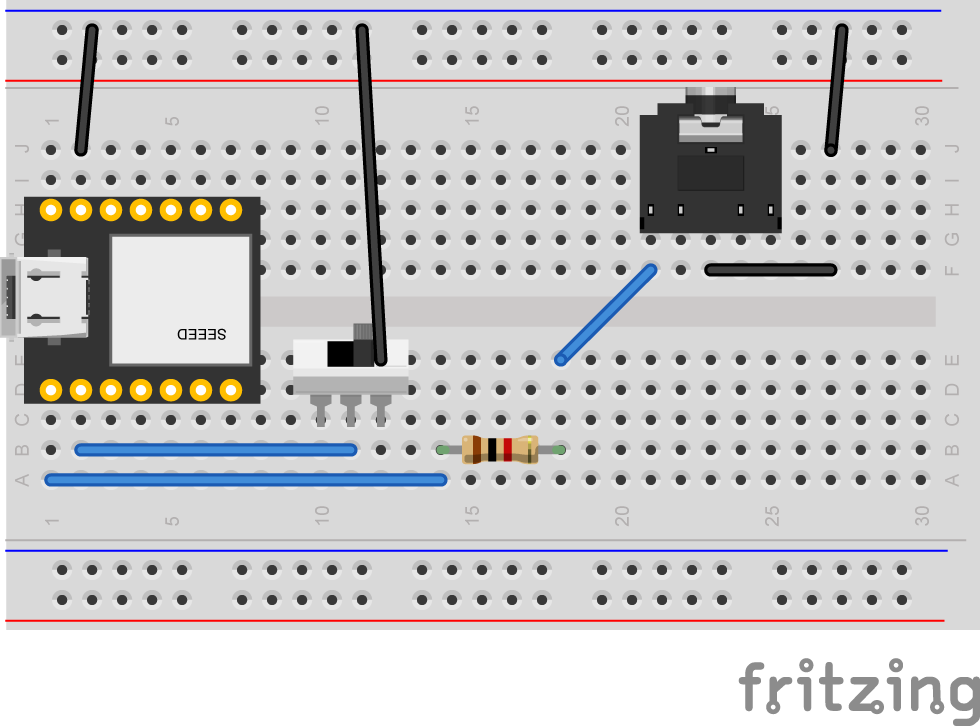

# USB MIDI to Sync Converter
USB MIDIのクロックメッセージをSYNC信号に変換します

## ビルド方法
### ターゲットマイコン
- Seeed XIAO RP2040

### ビルド
このプロジェクトのビルドにはArduino IDE2および以下のライブラリが必要です。
- board: [Arduino-pico](https://github.com/earlephilhower/arduino-pico) 4.0.2
- library: [Arduino MIDI Library](https://github.com/FortySevenEffects/arduino_midi_library) 5.0.2

ビルド設定  
- Tools->Board:->Raspberry Pi Pico/RP2040->Seed XIAO RP2040
- Tools->USB Stack:->Adafruilt TinyUSB

## 回路図
KiCadで作成した完全な[回路図](./hardware/KiCad/USBMIDItoSYNC_Converter/)

Sync信号出力端子のみの最小構成  


## 使用方法
送信側の機器とUSBケーブルで、受信側の機器と3.5mmのステレオミニケーブルで接続します。  
ランモードスイッチでMIDI START/STOPメッセージと連動してSync信号を出力するか、連動しないかを選択することができます。

### ランモードスイッチ
D1ピンにランモードスイッチ機能を割り当てています。D1端子は内部プルアップしているので開放時はHになります。

|D1 |動作|
|----|---------|
|L|MIDI Start/Stopメッセージに連動してSync信号を出力します|
|H|MIDIクロックを受信している間はSync信号を出力し続けます|

### DIN SYNC (試験的実装)
DIN SYNCのStart/Stop信号をD2ピンから出力しています。  
D2ピンはDIPスイッチの'DIN S'に割り当てられ、Sync端子のRINGに接続されています。  
'DIN S'をOnにするとRINGから出力、OffにするとRINGはオープンになります。

### TRS MIDI In/Out (TypeA)
USB MIDIとTRS MIDIの間でMIDIメッセージを転送します。簡易的なUSB MIDIコンバーターとして使用出来ます。
注:
- SysExには対応していません
- TRS MIDI INから入力したclockをSync信号に変換することはできません

### 設定用スイッチ
設定用スイッチでPPQ値やMIDIフィルターの設定ができます。  

|pin|名前 |設定             |
|---|-----|---------------------|
|D5 |MODE0|設定種<br>L:PPQ値の変更をスイッチで行う。PPQ値はEEPROMには保存されません。<br>H:PPQ値の設定をSysExで行う。PPQ値はEEPROMに保存される。
|D4 |MODE1|MODE0=L : PPQ値設定<br>MODE0=H : MIDIフィルター
|D3 |MODE2|MODE0=L : PPQ値設定<br>MODE0=H : MIDIフィルター

#### MODE0=0 PPQ値設定
|MODE1 |MODE2 | PPQ値  |
|------|------|--------|
|H(Off)|H(Off)|1       |
|H(Off)|L(On) |2       |
|L(On) |H(Off)|4       |
|L(On) |L(On) |24      |

#### MODE0=1 MIDI Filter
|MODE1 |MODE2 | フィルター設定                              |
|------|------|---------------------------------------------|
|H(Off)|H(Off)|全てのメッセージをUSBからTRS MIDI Outに転送  |
|H(Off)|L(On) |Clock, Start, Stop, Continueメッセージを転送 |
|L(On) |H(Off)|Clockのみ転送                                |
|L(On) |L(On) |無効 (予約済み)                              |

## Sync信号のパルス幅について
このプロジェクトではSync信号のパルス幅を5msに設定しています。  
コルグの仕様では15msですが、他の多くの会社の機器では5msに設定されていることによります。
パルス幅は ```DEFAULT_SPW```を ```SPW_15MS``` と定義することで15msに変更できます。

## SysExによるPPQ値変更
PPQ値をSysExメッセージにて変更することが可能です。  
1から24までの値を指定できますが24の約数でなければ正しく動作しません。  
PPQ値はEEPROMの0x00番地に格納されます。

|Byte[Hex] | Description                                     |
|:--------:|-------------------------------------------------|
|F0        | Exclusive Status                                |
|7E        | non realtime Universal System Exclusive Message |
|49        | Device ID                                       |
|0B        | File Reference Message                          |
|02        | Change (Select or Reselect)                     |
|nn        | PPQ : 1,2,3,4,6,8,0C(12d),18(24d)               |
|F7        | End Of Exclusive                                |

## SysExによるSync信号パルス幅の変更
Sync信号パルス幅をSysExメッセージにて変更することが可能です。  
5ms,15msのいずれかを設定できます。  
Sync信号パルス幅値はEEPROMの0x01番地に格納されます。

|Byte[Hex] | Description                                             |
|:--------:|---------------------------------------------------------|
|F0        | Exclusive Status                                        |
|7E        | non realtime Universal System Exclusive Message         |
|49        | Device ID                                               |
|0B        | File Reference Message                                  |
|02        | Change (Select or Reselect)                             |
|nn        | Pulse Width 5ms:3F(63d), 15ms:5F(95d), Reserved:7F(127d)|
|F7        | End Of Exclusive                                        |

assets/sysexにSysExファイルを格納しています。必要に応じて使用してください。

【注意】SysExメッセージは独自のものを定義するのではなく、ユニバーサル・システム・エクスクルーシブのFile Reference Messageを流用しています。

## ライセンス
USB MIDI to Sync Converter is open source and licensed under the [GPL3](/LICENSE) License.

