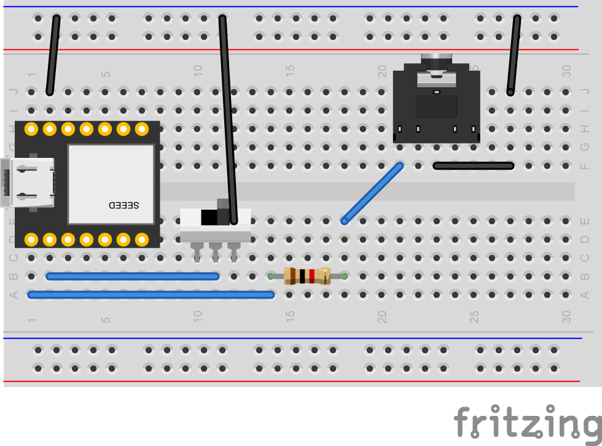

# USB MIDI to Sync Converter
Converts USB MIDI clock messages to sync signals.

[日本語版](README-ja.md)

## How to build
### Target microcontroller
- Seeed XIAO RP2040

### Build
This project uses Arduino IDE2 and requires the following libraries:
- board: [Arduino-pico](https://github.com/earlephilhower/arduino-pico) 4.0.2
- library: [Arduino MIDI Library](https://github.com/FortySevenEffects/arduino_midi_library) 5.0.2

Build setting:
- Tools->Board:->Raspberry Pi Pico/RP2040->Seed XIAO RP2040
- Tools->USB Stack:->Adafruilt TinyUSB

## Schematic
Complete schematic created in [KiCad](./hardware/KiCad/USBMIDItoSYNC_Converter/).

Minimum configuration with sync signal output terminal only



## Usage
Connects to the sending MIDI device with a USB cable and to the receiving device with a 3.5 mm stereo cable.  
The run mode switch can be used to select the action to be taken when a MIDI START/STOP message is received.

### Run mode switch
The D1 pin is assigned to mode switch. D1 is pulled up and goes High when open.

|D1 |behaviour|
|----|---------|
|Low |Sends out or stops the sync signal in conjunction with MIDI Start and Stop messages.|
|High|Free run. When MIDI Clock is received, the Sync signal is sent regardless of the playback status of the MIDI device.|

### DIN SYNC (experimental)
The DIN SYNC Start/Stop signal is output to the D2 pin.
D2 pin is assigned to 'DIN S' on the DIP switch and is connected to the RING of the Sync terminal.


### TRS MIDI In/Out (TypeA)
Transfers MIDI messages between USB MIDI and TRS MIDI.  
Note:
- SysEx is not supported.
- The clock input from TRS MIDI IN cannot be converted to a Sync signal.
  
### Setting switch
The setting switches can be used to set PPQ values and MIDI filter settings.  

|pin|name | setting             |
|---|-----|---------------------|
|D5 |MODE0|Type setting<br>L:PPQ values are changed using Setting switch. The value stored in the EEPROM is ignored.<br>H:PPQ values ​​are changed using SysEx messages. Settings are saved in EEPROM.
|D4 |MODE1|MODE0=L : PPQ selecter<br>MODE0=H : MIDI FilterSelector
|D3 |MODE2|MODE0=L : PPQ selecter<br>MODE0=H : MIDI FilterSelector

#### MODE0=0 PPQ selector
|MODE1 |MODE2 | PPQ    |
|------|------|--------|
|H(Off)|H(Off)|1       |
|H(Off)|L(On) |2       |
|L(On) |H(Off)|4       |
|L(On) |L(On) |24      |

#### MODE0=1 MIDI Filter
|MODE1 |MODE2 | Filter                                             |
|------|------|----------------------------------------------------|
|H(Off)|H(Off)|All messages are forwarded from USB to TRS MIDI Out |
|H(Off)|L(On) |Only Clock, Start, Stop, Continue are fowarded.     |
|L(On) |H(Off)|Foward only clocks                                  |
|L(On) |L(On) |N/A (Reserved)                                      |


## About the pulse width of the sync signal
In this project, the pulse width of the sync signal is set to 5 ms.  
The reason for this is that the KORG specification is 15 ms, but many other companies' devices use 5 ms.  
If you want to change this, modify the definition of ```DEFAULT_SPW``` to ```SPW_15MS``` and rebuild.

## Change the PPQ via SysEx message
The PPQ values can be changed using SysEx messages.  
You can specify a value between 1 and 24, but it will not work correctly unless it is a divisor of 24.  
The PPQ value is stored in the EEPROM at location 0x00.

|Byte[Hex] | Description                                     |
|:--------:|-------------------------------------------------|
|F0        | Exclusive Status                                |
|7E        | non realtime Universal System Exclusive Message |
|49        | Device ID                                       |
|0B        | File Reference Message                          |
|02        | Change (Select or Reselect)                     |
|nn        | PPQ : 1,2,3,4,6,8,0Ch(12),18h(24)               |
|F7        | End Of Exclusive                                |

## Change the Sync signal pulse width via SysEx message
The Sync signal pulse width can be changed using a SysEx message.  
It can be set to 5ms or 15ms.  
The Sync signal pulse width value is stored in the EEPROM at location 0x01.

|Byte[Hex] | Description                                             |
|:--------:|---------------------------------------------------------|
|F0        | Exclusive Status                                        |
|7E        | non realtime Universal System Exclusive Message         |
|49        | Device ID                                               |
|0B        | File Reference Message                                  |
|02        | Change (Select or Reselect)                             |
|nn        | Pulse Width 5ms:3Fh(63), 15ms:5Fh(95), Reserved:7Fh(127)|
|F7        | End Of Exclusive                                        |


SysEx files are stored in assets/sysex. Use as needed.

Note: The SysEx message does not define a dedicated one, but rather diverts the universal system-exclusive File Reference Message.

## License
USB MIDI to Sync Converter is open source and licensed under the [GPL3](/LICENSE) License.
